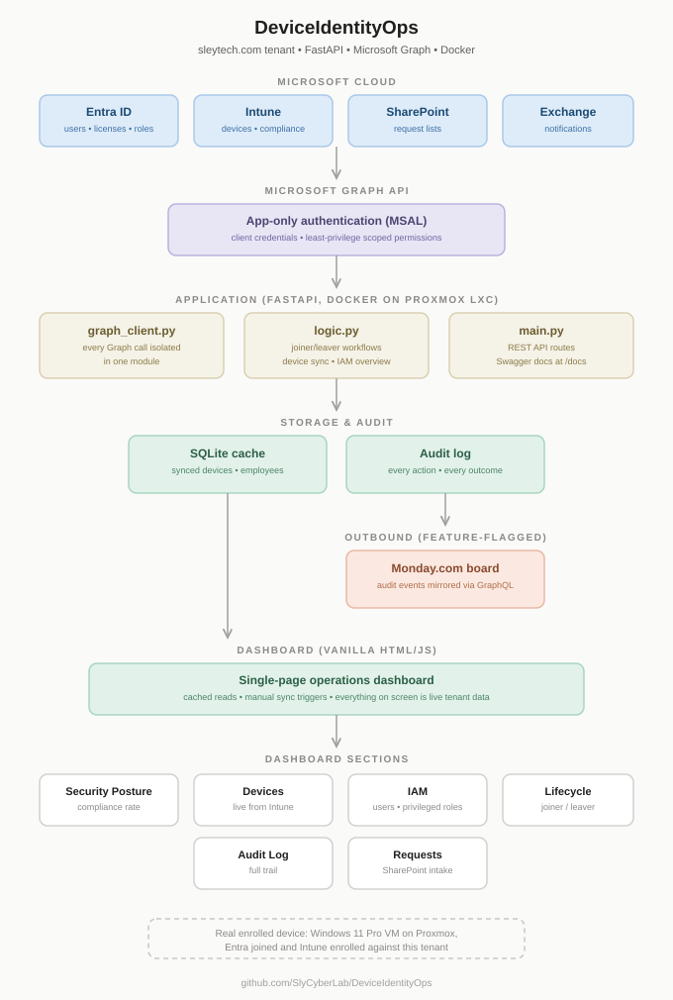

# DeviceIdentityOps

A cloud-native IT operations tool that automates the device and identity lifecycle on top of Microsoft 365. It reads joiner and leaver requests from SharePoint, provisions and offboards real Entra ID accounts, syncs enrolled devices from Intune, surfaces IAM posture, and writes an audit trail for every action it takes.

Built with FastAPI, SQLite, vanilla HTML/JS, and Docker, running against a real Microsoft 365 Business Premium tenant.



## Why this exists

My earlier [Identity Lifecycle Automation](https://blog.slytech.us/blog/identity-automation/) project proved the joiner/leaver pattern with PowerShell against a hybrid AD environment: HR submits a request, automation creates the account, syncs it to the cloud, licenses it, and notifies the manager. That version depended on a domain controller, Entra Connect, and a 36 second sync wait.

This project re-implements the same pattern cloud-only. No AD, no sync engine, no waiting. Requests land in SharePoint lists, a FastAPI service reads them through Microsoft Graph with app-only auth, and accounts are created directly in Entra ID. Then it goes further than the original: live Intune device inventory, a security posture summary, and an IAM view that shows who holds privileged roles.

The design rule for the whole tool: everything on screen is real. The device table is a live Intune sync. The user table is a live Entra ID read. The one enrolled device is an actual Windows 11 Pro VM on my Proxmox host, Entra joined and Intune enrolled against this tenant. Earlier versions carried a seeded mock fleet for development; it was removed once the real integrations came online.

## What it does

**Identity lifecycle (joiner / leaver)**
- Intake forms on the dashboard write requests to SharePoint lists, which stay the system of record. A Power Apps form or any other front end could write to the same lists without changing anything downstream.
- Processing reads Pending items and runs the full chain: create the Entra ID user, set usage location, assign a Business Premium license, notify the manager by email with first-day credentials and MFA instructions, then write the result back to the SharePoint item.
- Offboarding disables sign-in, revokes every active session, reclaims the license, and notifies the manager. The account object is retained on purpose. Disable, do not delete, is the correct lifecycle practice: it preserves mailbox and file access for handover, keeps the audit trail intact, and stays reversible.

**Device management**
- One click syncs managed devices from Intune into a local cache: hostname, serial, assigned user, OS build, compliance state, encryption state, last check-in.
- Compliance state reflects a real Intune compliance policy (BitLocker, Secure Boot, Defender, minimum OS) evaluating a real enrolled device.
- A Security Posture summary rolls the fleet up into compliance rate, encryption coverage, and a plain language line about what needs attention.

**IAM view**
- Tenant users live from Entra ID, with enabled/disabled state, license state, and a lifecycle badge showing which accounts this tool itself provisioned or offboarded.
- Privileged directory roles and their members, because least privilege starts with knowing who holds standing admin rights.
- Observation lines in plain language: disabled accounts still holding a license, Global Administrator count against the recommended maximum, and honest notes when data is unavailable rather than hiding the section.

**Audit and integrations**
- Every action gets an audit log entry: what ran, against whom, and the outcome.
- Optional Monday.com integration mirrors audit events to a board through one GraphQL mutation per event. It is feature-flagged: without a token the code path is a silent no-op. Outbound-only was a deliberate choice; it needs no public endpoint, no webhook handshake, and cannot break the primary workflow.

## Design decisions worth explaining

**Manual process triggers instead of a scheduler.** The Process Requests buttons are stand-ins for a scheduled job, kept manual so each stage is visible during a walkthrough. The production version is a timer, not a button, and the original PowerShell project ran exactly that way through Task Scheduler.

**Cached reads with explicit refresh instead of live API calls per page load.** The dashboard renders instantly from the last sync and the operator chooses when to pull fresh data. This is how real inventory tools behave, and it means a slow Graph response can never hang the page.

**Every Graph call isolated in one module.** `graph_client.py` owns authentication and every API call. Swapping permissions, adding endpoints, or pointing at a different tenant never touches the workflow logic or the routes.

**Separation of intake and execution.** Submitting a request records intent in SharePoint. Executing it is a separate step. In a real org that separation is where approvals, batching, and change control live, and it means the form is never wired directly to identity provisioning.

**Operations here, governance elsewhere.** This tool does the operational half of IAM: provisioning, deprovisioning, visibility into who and what exists right now. Deeper governance, drift detection between snapshots, privileged access change tracking, and compliance scoring live in a separate project, the [Identity Governance Portal](https://blog.slytech.us/blog/identity-governance-portal/), because detection and remediation deserve different tools.

## Stack

| Layer | Choice | Why |
|---|---|---|
| API | FastAPI | Typed request/response models, automatic Swagger docs at `/docs` |
| Graph auth | MSAL, client credentials | App-only auth, no user context, least-privilege scoped permissions |
| Storage | SQLite | Right-sized for a single-node ops tool; the cache is rebuildable from Graph |
| Frontend | Vanilla HTML/JS | No build step, no framework risk, one file |
| Runtime | Docker on a Proxmox LXC | Rebuild and redeploy in one command |

## API

| Method | Endpoint | Purpose |
|---|---|---|
| GET | `/api/health` | Liveness check |
| GET | `/api/devices` | Cached device inventory |
| POST | `/api/devices/refresh-intune` | Sync managed devices from Intune |
| GET | `/api/identity` | Live IAM overview: users, privileged roles, observations |
| POST | `/api/onboarding/submit` | Create a Pending new-hire request in SharePoint |
| POST | `/api/offboarding/submit` | Create a Pending offboarding request in SharePoint |
| POST | `/api/onboarding/process` | Provision all Pending new hires |
| POST | `/api/offboarding/process` | Offboard all Pending leavers |
| GET | `/api/audit` | Audit trail |

Interactive docs at `/docs` once running.

## Setup

Requirements: a Microsoft 365 tenant, an Entra ID app registration with admin-consented application permissions (`User.ReadWrite.All`, `Group.ReadWrite.All`, `Sites.ReadWrite.All`, `DeviceManagementManagedDevices.Read.All`, `Mail.Send`, `Organization.Read.All`, and `RoleManagement.Read.Directory` for the privileged roles view), and a SharePoint site with the two request lists.

```bash
cp .env.example .env    # fill in tenant, client, secret, site and list IDs
docker build -t deviceidentityops .
docker run -d -p 8000:8000 --env-file .env --restart unless-stopped --name deviceidentityops deviceidentityops
```

Secrets live only in `.env`, which is gitignored. Nothing sensitive is hardcoded; the one hardcoded GUID is the Business Premium license SKU, which is a public Microsoft product identifier.

## Things that bit me, documented on purpose

- **Graph rejects `$filter` on non-indexed SharePoint columns** with a bare 400. The fix is the `Prefer: HonorNonIndexedQueriesWarningMayFailRandomly` header, which is exactly as reassuring as it sounds.
- **`O365_BUSINESS_PREMIUM` is not Business Premium.** That legacy SKU string maps to what is now called Business Standard. The real Business Premium SKU is `SPB`. Verify against `subscribedSkus` instead of trusting the name.
- **Entra join does not equal Intune enrollment.** A device joined while the MDM user scope was still None never gets told to enroll, and changing the scope is not retroactive. `deviceenroller.exe /c /AutoEnrollMDM` triggers it for an already-joined device.
- **SharePoint list item creation can silently drop a field** it fails to resolve, without erroring. Writing the built-in `Title` column as well, which always resolves, is the reliable fallback.

## Related projects

- [Identity Lifecycle Automation](https://github.com/SlyCyberLab/IdentityLifecycleAutomation): the original hybrid AD joiner/leaver automation in PowerShell this project is modeled on
- [Identity Governance Portal](https://github.com/SlyCyberLab/IdentityGovernancePortal): the governance and drift-monitoring layer, with an AI copilot grounded in tenant snapshots
